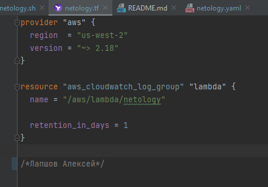
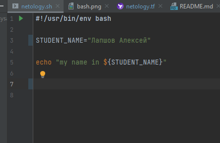
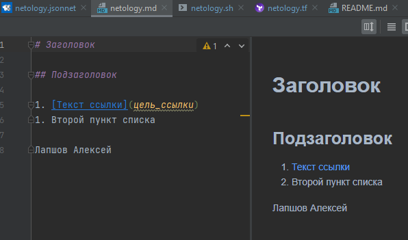
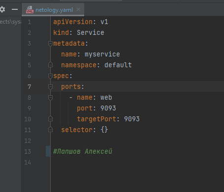
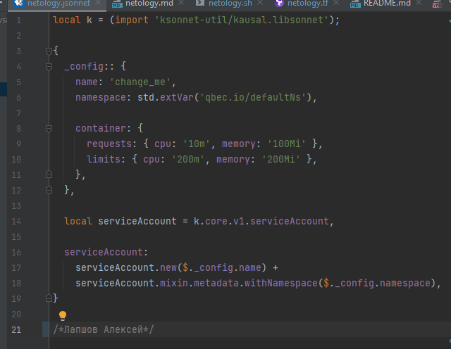

###Лапшов Алексей

# Домашнее задание к занятию «1.1. Введение в DevOps»

## Задание №1 - Подготовка рабочей среды

1. Мои картинки:
    - Terraform: 
    - Bash: 
    - Markdown: 
    - Yaml: 
    - Jsonnet: 

## Задание №2 - Описание жизненного цикла задачи (разработки нового функционала)

Жизненный цикл:
1. Выявление функциональных и бизнес требований (руководитель проекта, пользователи) 
3. Формирование бэклога продукта (команда проекта)
4. Планирование очередного спринта (руководитель проекта)
5. Включение наиболее важных задач в спринт (команда)
6. Проработка задач аналитиками и передача их в разработку (аналитики)
7. Разработка программного обеспечения (разработчики)
8. Создание отдельных веток для каждой задачи (разработчики)
9. После завершения задач разработчиками сборка и тестирование проекта (разработчики, devops, тестировщики)
10. Выкладка проекта сначала на тестовую среду (тестировщики, devops)
11. После успешного тестирования выкладка проекта на Production (devops)
12. Закрытие задач, перенос того что не успели на следующий спринт (руководитель проекта)